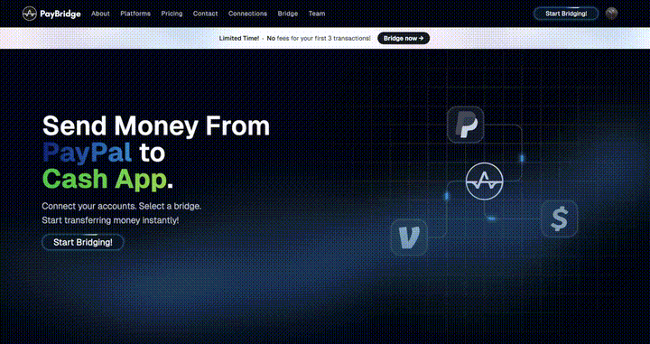
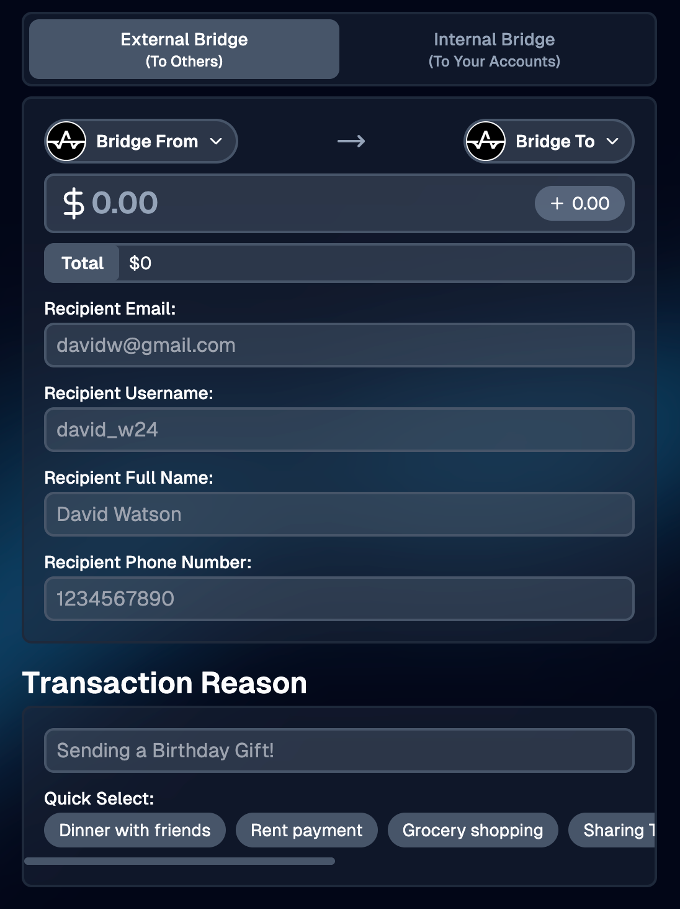
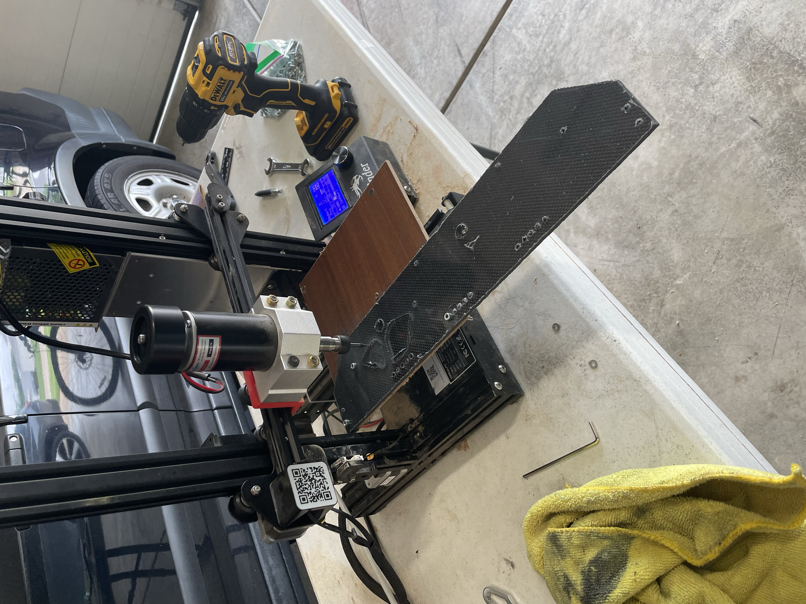
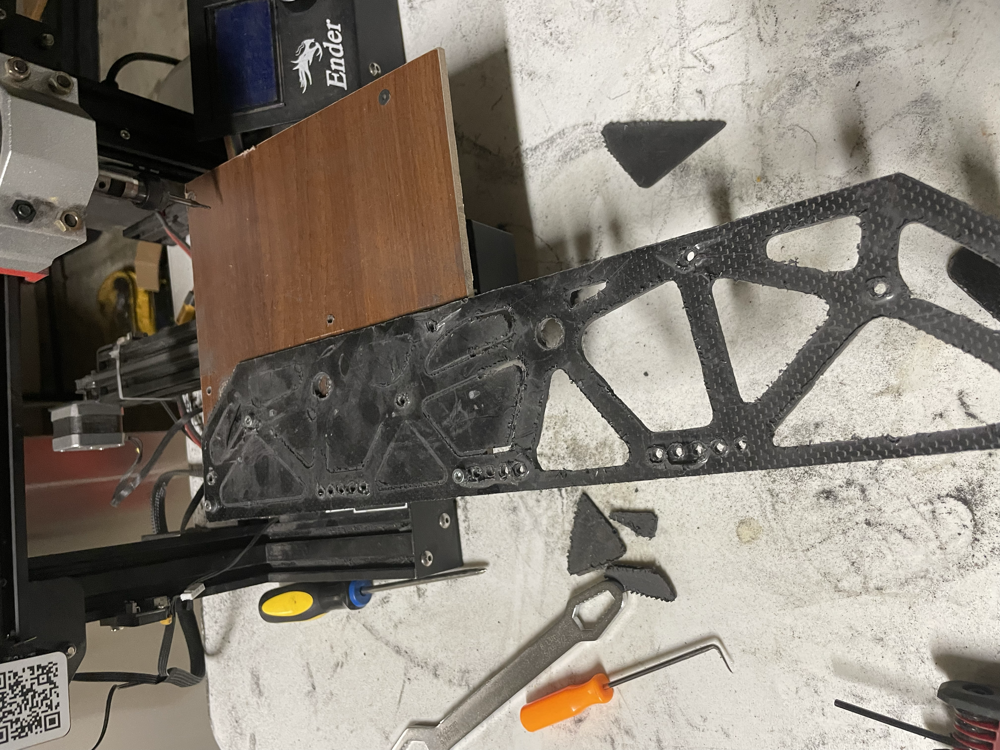
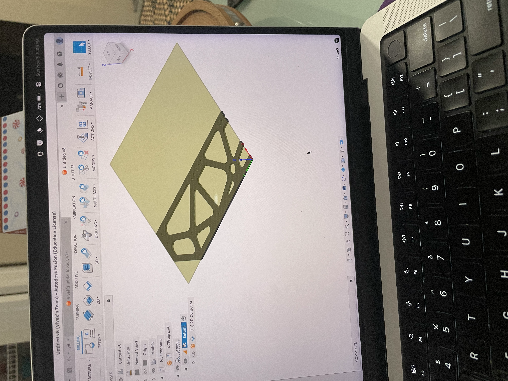
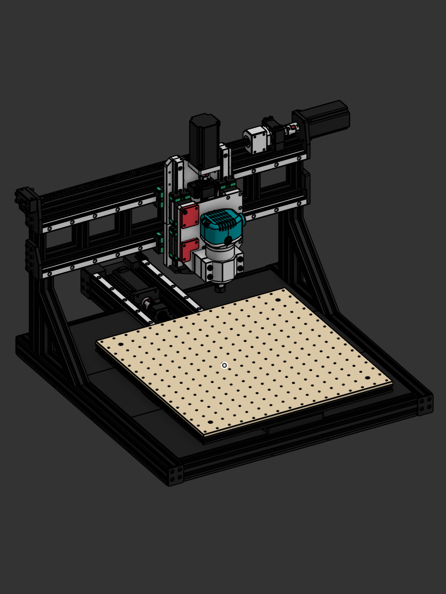
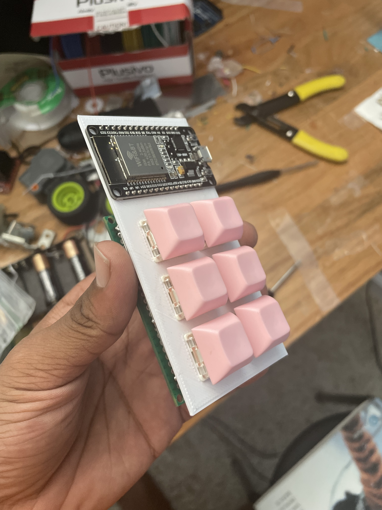
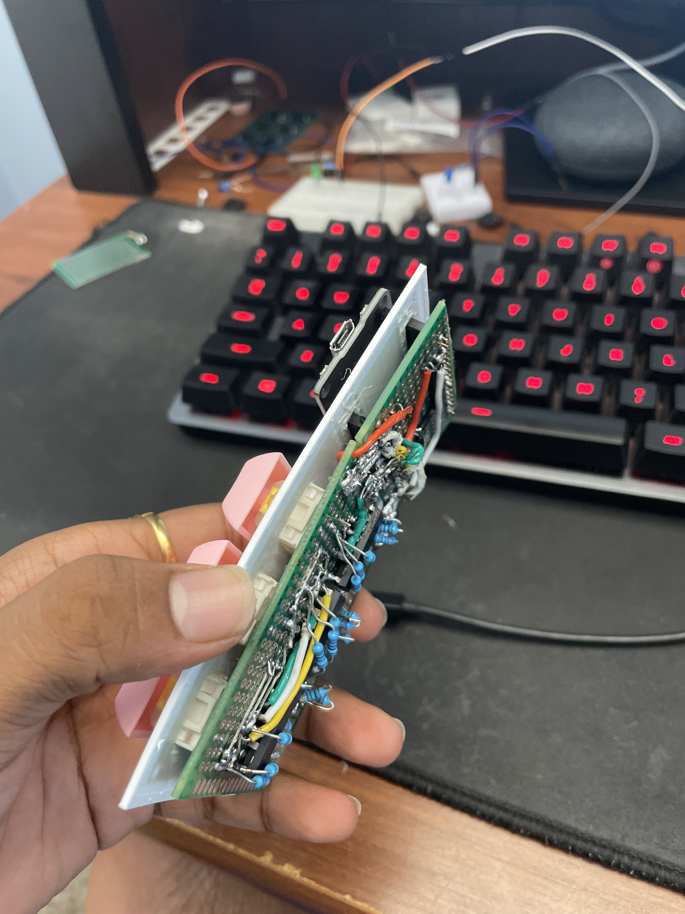

# Founded and Captained FTC Team #23250

    
    
    
    
    

    
    
    

As captain of the FIRST Tech Challenge team Verge, I designed, funded, manufactured, built, and programmed 10+ unique iterations of robots across 3 seasons while managing a team of up to 24 team members and junior members. All above videos showcase completely autonomous sensor based routines programmed in Java through Android Studio. Sensors used include color, proximity, encoder, odometry, and accelerometer. Algorithims used include PID, Kalman filters, and OpenCV. Tensorflow was also used for image detection. Onshape and Fusion360 were used for full robot design including hundereds of 3D printed parts and dozens parts cut from aluminum and carbon fiber plates. Participated in 10 championships, 12 meets, 4 scrimmages, and 130+ outreach events, winning 12 awards including state titles and worlds awards across 3 years.

[See 2026 FTC Decode Worlds CAD Model](https://cad.onshape.com/documents/f9c50239f003f284218caf4b/w/a1ea846a776226659ce67be6/e/d9500bb17ace6d445a5c32a7?renderMode=0&uiState=6a974d5e0a2f6a820ac0c63d). 

[See 2026 FTC Decode Worlds Engineering Portfolio](https://drive.google.com/file/d/1tqqMHz2c_Pck58GzC4pZWlwsdKCINmBz/view?usp=sharing). 

  

# PayBridge Technologies LLC

    
    
    
    
    

    
    

As the founding frontend engineer, I was a part of the fintech startup PayBridge. I lead the frontend team to significantly improve user experience by creating a custom website tailored to PayBridge. After pushing the new frontend to production, we hit $3500+ in transaction volume and I improved clickthrough rate to the main service by 214%. PayPal, Cash App and Venmo are supported with our service and we grew a small recurring user-base. I made full use of the Next.JS server-side architecture to keep the platform responsive, secure, and quick to load, but ensured the React frontend didn't compromise on interactivity. I learned a lot about CI/CD pipelines and collaborating with a team of engineers over Github during my time with PayBridge.

[See PayBridge Website](https://paybridgetech.com/). 

  

# DIY CNC Routers

    
    
    
    

    
    
    
    

I modified an old Ender 3 Pro 3D printer by removing the toolhead and heated bed and replacing them with a scrap piece of wood and a cheap 500 Watt brushed spindle motor. I supplied 48v to it through a power supply and used a potentiometer to vary the speed of the spindle. I programmed the machine using Fusion 360's built-in path generator features and exported into marlin gcode to run off the modified Ender's SD card. This setup was capable of cutting 2.5mm carbon fiber sheets provided conservative cutting speeds. To improve the speed and accuracy of the system, I designed a fully custom machine built from rigid aluminum extrusion, NEMA23 stepper motors, ball screw powered motion, and a 1.25hp router as the spindle.

[See OpenRouter-CNC CAD Model](https://cad.onshape.com/documents/1be3dd1297bd274db94cd8d0/w/4117030b8ce5217ce517a7e1/e/fc0214e438d29ed3bbffd0ba?renderMode=0&uiState=6a9786fbf9e38beda7fea2c7). 

  

# IoT Smart Devices with Siri Integration

    
    
    
    
    
    

    
    
    
    

I engineered IoT smart blinds and smart lamp systems using ESP32 microcontrollers, a NEMA17 stepper motor, an L298N driver module connected to the window's operating shaft via a custom 3D-printed adapter, and a 5V relay with optocoupler to switch 120V mains power to the bedlamp. The ESP32 runs C++ firmware hosting a lightweight RESTful HTTP API, enabling seamless remote control and voice integration via Apple Shortcuts and Siri.

  

# ESP32 Based Bluetooth Macro Pad

    
    
    
    
    

    
    
    

I designed, fabricated, assembled, and programmed a Macro Pad with six programmable and hot-swappable keys as well as six RGB LED lights making for 18 total LED channels and 6 input channels to control. I achieved this by using multiple shift registers to write data to every LED channel through just a few signal pins. each key switch got its own input pin on the ESP32. Bluetooth was used to pair with and control the computer, but power was provided by USB. A battery pack could be attatched to use the macro pad wirelessly. The project was compatible with Windows and MacOS. I learned a lot about programming wireless protocols and designing working circuits. Careful wiring and programming was neccessary to control all 18 LED channels through the shift registers while recieving input from the key switches and maintaining the bluetooth connection. A low power mode was also programmed to save battery life.