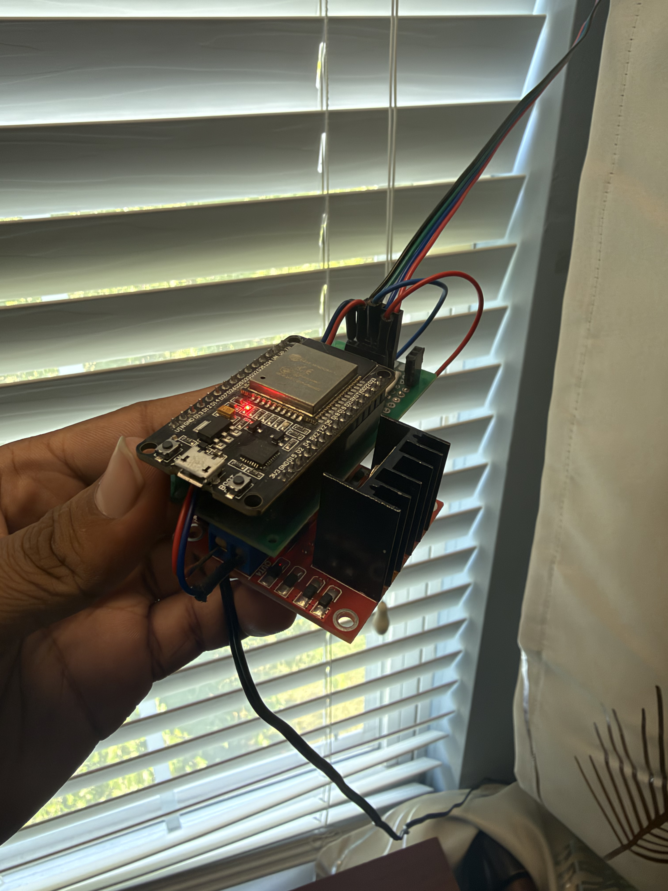
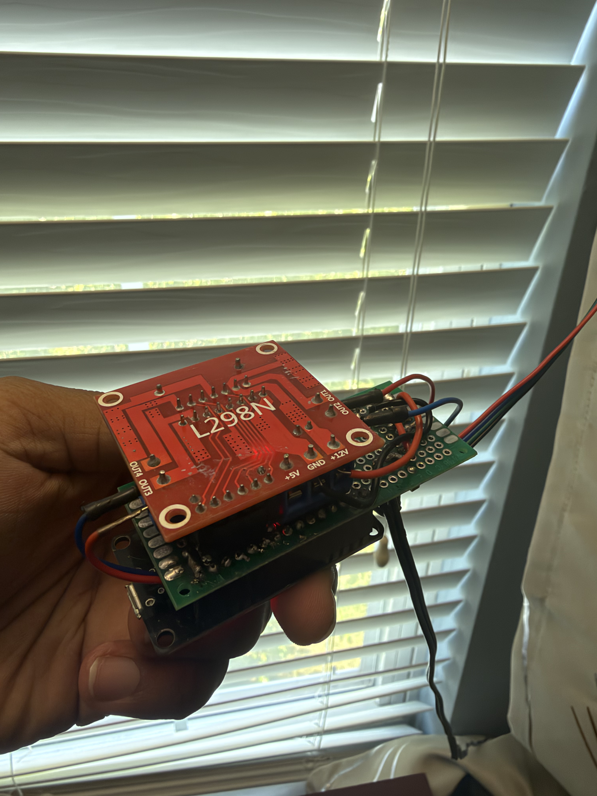
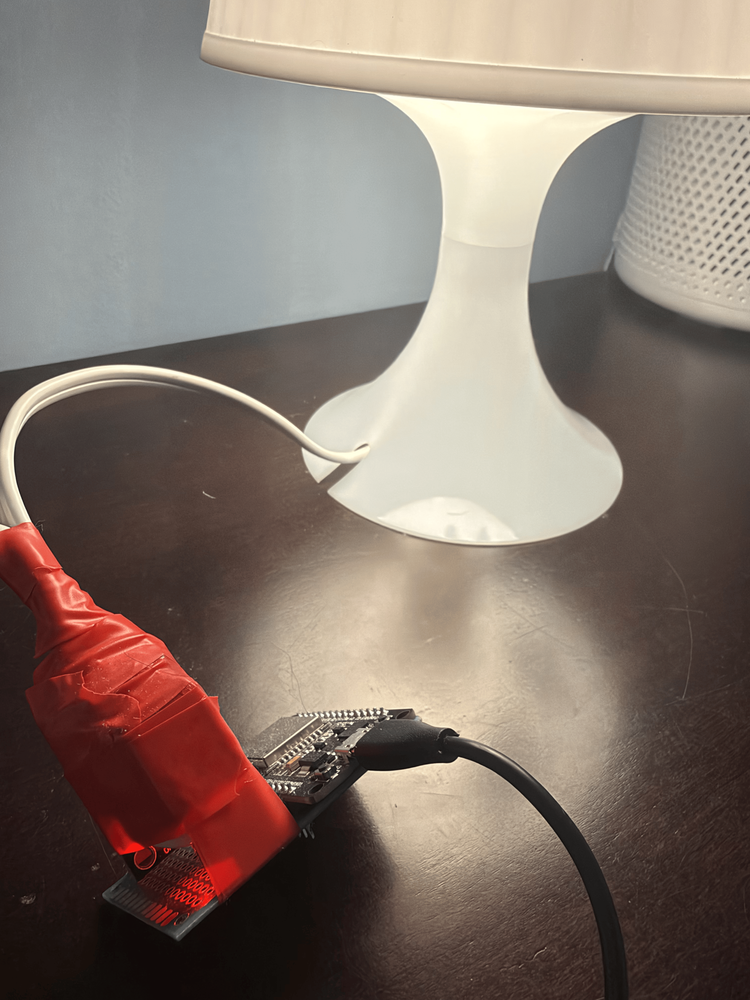
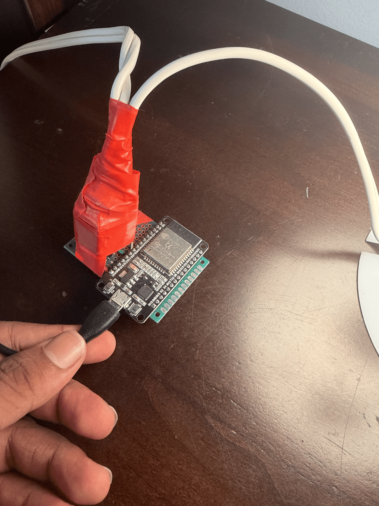

# IoT Smart Blinds with Siri Integration

## 📸 Gallery

    
    
    

## 🛠️ Tech Stack

* **Microcontroller:** ESP32 Dev Kit
* **Motor & Driver:** NEMA17 Stepper Motor, L298N Motor Driver Module
* **Firmware:** C++ (Arduino IDE / ESP-IDF)
* **Integration:** Apple Shortcuts, RESTful HTTP API

## 🚀 Design Process

* Engineered a custom IoT control board pairing an ESP32 microcontroller with an L298N motor driver module to actuate the window blinds.
* Fabricated a custom 3D-printed adapter to securely couple a NEMA17 stepper motor directly to the blinds operating shaft.
* Programmed the ESP32 in C++ using the Arduino IDE, implementing a lightweight RESTful HTTP API to handle remote control commands.
* Configured Apple Shortcuts to trigger HTTP endpoints via any Apple device, enabling seamless voice control through Siri.

  

# IoT Smart Lamp with Siri Integration

## 📸 Gallery

    
    
    

## 🛠️ Tech Stack

* **Microcontroller:** ESP32 Dev Kit
* **High Power Switching:** 5V Relay with Optocoupler Isolation for 120V AC
* **Firmware:** C++ (Arduino IDE / ESP-IDF)
* **Integration:** Apple Shortcuts, RESTful HTTP API

## 🚀 Design Process

* Engineered a custom IoT control board pairing an ESP32 microcontroller with a 5V relay module to switch the 120v mains current to the lamp.
* Programmed the ESP32 in C++ using the Arduino IDE, implementing a lightweight RESTful HTTP API to handle remote control commands.
* Configured Apple Shortcuts to trigger HTTP endpoints via any Apple device, enabling seamless voice control through Siri.
